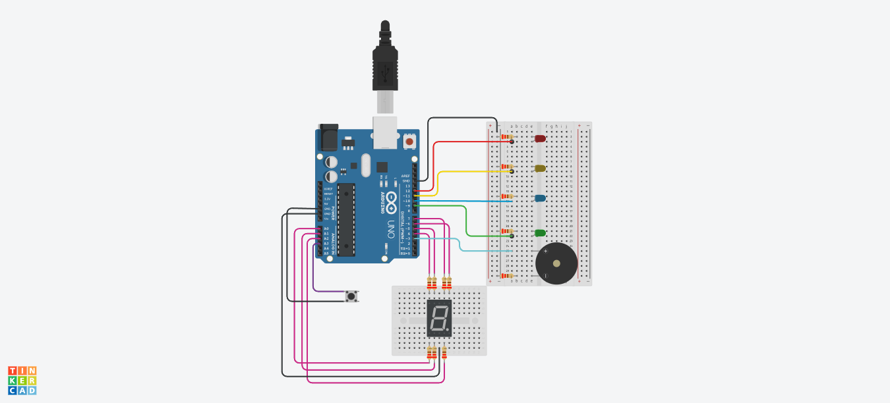

# Dojo_numero_dos
## Integrantes
---
* Antuñez, Juan Ignacio.
* Barrientos, Gonzalo.
* Cortés, Abril.
* Famozo, Luca.
## Proyecto: Estación de subte
---

## Descripción
---
El proyecto consiste en la elaboración de un sistema que permita al usuario saber a qué estación de subte está llegando, mediante el uso de leds que indican en qué estación se encuentra, un sonido que se reproduce al llegar a una estación, diferente para cada una y un display que muestra la cantidad de estaciones que faltan para llegar a destino. Todo esto se enciende mediante el uso de un botón. 
## Función principal
---
~~~c++
bool flag = false;

void loop()
{
  int p = digitalRead(pulsador);
  if(p == 0 or flag)
  {
    flag = true;
  	display(3);
  	prender_sonar_apagar(constitucion,260);
  	display_off();
  	display(2);
  	prender_sonar_apagar(san_juan,359);
  	display_off();
  	display(1);
  	prender_sonar_apagar(independencia,440);
  	display_off();
  	display(0);
  	prender_sonar_apagar(moreno,566);
  	display_off();
  }
}
~~~
La función principal guarda en una variable el valor de el botón y se valida si este fue presionado, usa una bandera para establecer que el botón ya fue presionado una vez, luego llama la función **display** que enciende el display según el número pasado por parámetro.
~~~c++
void display(int num)
{
  switch(num)
  {
    case 0:
    	digitalWrite(A, HIGH);
    	digitalWrite(B, HIGH);
    	digitalWrite(C, HIGH);
    	digitalWrite(D, HIGH);
    	digitalWrite(E, HIGH);
    	digitalWrite(F, HIGH);
    break;
    case 1:
        digitalWrite(B, HIGH);
    	digitalWrite(C, HIGH);
    break;
    case 2:
    	digitalWrite(A, HIGH);
    	digitalWrite(B, HIGH);
        digitalWrite(D, HIGH);
    	digitalWrite(E, HIGH);
    	digitalWrite(G, HIGH);
    break;
    case 3:
        digitalWrite(A, HIGH);
    	digitalWrite(B, HIGH);
        digitalWrite(C, HIGH);
    	digitalWrite(D, HIGH);
    	digitalWrite(G, HIGH);
    break;
    case 4:
    	digitalWrite(B, HIGH);
        digitalWrite(C, HIGH);
    	digitalWrite(F, HIGH);
    	digitalWrite(G, HIGH);
    break;
    case 5:
     	digitalWrite(A, HIGH);
    	digitalWrite(C, HIGH);
        digitalWrite(D, HIGH);
    	digitalWrite(F, HIGH);
    	digitalWrite(G, HIGH);
    break;
    case 6:
        digitalWrite(A, HIGH);
    	digitalWrite(C, HIGH);
        digitalWrite(D, HIGH);
    	digitalWrite(E, HIGH);
    	digitalWrite(F, HIGH);
    	digitalWrite(G, HIGH);
    break;
    case 7:
    	digitalWrite(A, HIGH);
    	digitalWrite(B, HIGH);
        digitalWrite(C, HIGH);
    break;
    case 8:
        digitalWrite(A, HIGH);
    	digitalWrite(B, HIGH);
    	digitalWrite(C, HIGH);
    	digitalWrite(D, HIGH);
    	digitalWrite(E, HIGH);
    	digitalWrite(F, HIGH);
    	digitalWrite(G, HIGH);
    break;
    case 9:
        digitalWrite(A, HIGH);
    	digitalWrite(B, HIGH);
    	digitalWrite(C, HIGH);
    	digitalWrite(D, HIGH);
    	digitalWrite(F, HIGH);
    	digitalWrite(G, HIGH);
    break;
  }
}
~~~
Después de encender el display se llama a la función **prender_sonar_apagar** que recibe por parámetro la estación de subte a prender y los herzios de cómo debe sonar.
~~~c++
void prender_sonar_apagar(int led, int hz)
{
  digitalWrite(led, HIGH);
  tone(buzzer,hz,200);
  delay(1000);
  digitalWrite(led, LOW);
  delay(2000);
}
~~~
Una vez haya terminado, se llama a la función **display_off** que apaga todos los leds del display.
~~~c++
void display_off()
{
  digitalWrite(A, LOW);
  digitalWrite(B, LOW);
  digitalWrite(C, LOW);
  digitalWrite(D, LOW);
  digitalWrite(E, LOW);
  digitalWrite(F, LOW);
  digitalWrite(G, LOW);
}
~~~
La función principal repite este proceso para cada estación necesaria.
## Link al proyecto
* [Proyecto](https://www.tinkercad.com/things/ii2bPg36b3W)
---
